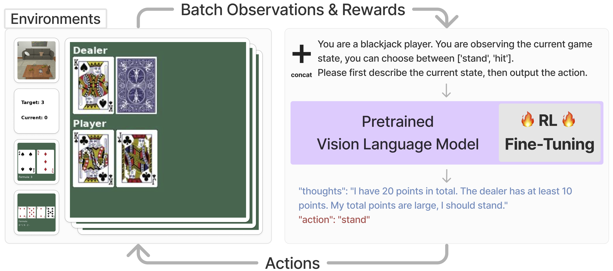

# Fine-Tuning Large Vision-Language Models as Decision-Making Agents via Reinforcement Learning

[Yuexiang Zhai](https://yx-s-z.github.io/)*, [Hao Bai](https://www.jackgethome.com/)†, [Zipeng Lin](https://zipeng-lin.github.io/)†, [Jiayi Pan](https://www.jiayipan.me/)†, [Shengbang Tong](https://tsb0601.github.io/petertongsb/)†, [Yifei Zhou](https://yifeizhou02.github.io/)†

[Alane Suhr](https://www.alanesuhr.com/), [Saining Xie](https://www.sainingxie.com/), [Yann LeCun](https://yann.lecun.com/), [Yi Ma](https://people.eecs.berkeley.edu/~yima/), [Sergey Levine](https://people.eecs.berkeley.edu/~svlevine/)

*Project Lead, †Equal Contribution.

## [Paper](https://arxiv.org/abs/2405.10292) | [Project Page](https://rl4vlm.github.io/) | [Wandb Report](https://api.wandb.ai/links/berkeley-cont-gen/ewqcdfaa) | [Data](https://huggingface.co/LEVI-Project/sft-data/tree/main)



## Contents:
0. [Codebase Structure](#codebase-structure)
1. [Getting Started](#getting-started)
2. [License](#license)
3. [Citation](#citation)
4. [Acknowledgement](#acknowledgement)


## Codebase Structure
<a id="codebase-structure"></a>

Our project contains three different codebases:
1. A slightly modified version of [LLaVA](https://github.com/haotian-liu/LLaVA).
    - See our `git diff` from the LLaVA branch [here](./diff_output.txt).
2. Our original [GymCards](./gym-cards/README.md) environment.
3. The RL4VLM codebases for both the [GymCards](./gym-cards/README.md) and [ALFWorld](https://github.com/alfworld/alfworld) environment.
    - Check [here](./VLM_PPO/README.md) for instructions on running our algorithm on GymCards.
    - Check Check [here](./VLM_PPO_ALF/README.md) for instructions on running our algorithm on ALFWorld.
    - We provide two different conda environments for GymCards and ALFWorld due to some package discrepancies.

## Getting Started
<a id="getting-started"></a>

Our training pipelines consists of two steps:
1. Prepare for an SFT checkpoint.
    - Check [here](https://huggingface.co/LEVI-Project/sft-data/tree/main) to download the instruction-following data we prepared for running the initial SFT.
    - We provide a [template script](./finetune.sh) (adpted from the official [finetune.sh](./LLaVA/scripts/v1_5/finetune.sh) for the 1.6-mistral model) for running LLaVA sft. Please remember to set the `--data_path`, `--image_folder`, and `--output_dir` accordingly.
    - Please follow the instructions for LLaVA fine-tuning [here](./LLaVA/README.md).
    - Our experiments start from the [llava-1.6-mistral-7b](https://huggingface.co/liuhaotian/llava-v1.6-mistral-7b) checkpoint, you are welcome to use any initial models, but no guarantee to achieve a similar performance.
2. Running RL using the SFT checkpoint.
    - For GymCards, please use these [.sh run scripts](./VLM_PPO/scripts/).
        -  Check [here](./VLM_PPO/README.md) for conda environment instllation.
        - **[important]** You may change the `num_processes` in [config_zero2.yaml](./VLM_PPO/scripts/config_zero2.yaml) to the numbers of GPUs you have. Please make sure the number of GPUs you set `CUDA_VISIBLE_DEVICES` in the `.sh` file `>=` the `num_processes` in config_zero2.yaml.
        - **[important]** If you only want to play aroud with our codebase, rather than reproduce our results. You may also skip the SFT from step 1, and directly use the llava1.6 model`liuhaotian/llava-v1.6-mistral-7b` as your initial model in `--model-path`.

    - For ALFWorld please use [this run file](./VLM_PPO_ALF/scripts/run_alf.sh).
        - Check [here](./VLM_PPO_ALF/README.md) for conda environment instllation.
        - The `num_processes` in [config_zero2.yaml](./VLM_PPO_ALF/scripts/config_zero2.yaml) and the number of GPUs in the `run_alf.sh` file should follow the same rule as GymCards. We recommend only using 1 GPU to run ALFWorld, because the time for on-policy data collection largely varies across different GPUs, which may lead to NCCL time out during the synchronization of different threads with multiple GPUs.

## License
<a id="license"></a>
This project is under the [MIT License](./LICENSE.txt).

## Citation

If you find our codebases useful, please consider citing our paper:
```plaintext
@misc{zhai2024fine,
  title={Fine-Tuning Large Vision-Language Models as Decision-Making Agents via Reinforcement Learning},
  author={Zhai, Yuexiang and Bai, Hao and Lin, Zipeng and Pan, Jiayi and Tong, Shengbang and Zhou, Yifei and Suhr, Alane and Xie, Saining and LeCun, Yann and Ma, Yi and Levine, Sergey},
  journal={arXiv preprint arXiv:2405.10292},
  year={2024}
}
```
## Acknowledgement
<a id="acknowledgement"></a>
Our codebases adopt [LLaVA](https://github.com/haotian-liu/LLaVA) as a backbone model and apply [PPO from this repo](https://github.com/ikostrikov/pytorch-a2c-ppo-acktr-gail) for RL fine-tuning. In principle, one may try to adapt our pipeline to different VLM / MLLM backbones and different RL algorithms.

